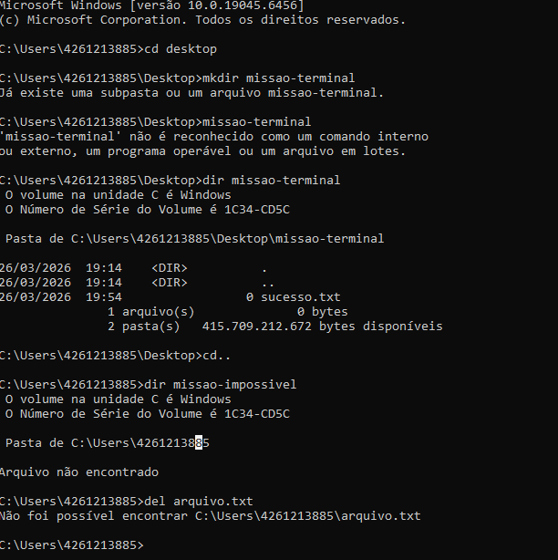

# una-ihcux-lista1

# ⚡ Meus Comandos Favoritos
Aqui estão os comandos que mais utilizei na aula de Terminal:

- `cd`: Para navegar entre pastas.
- `dir`: Para listar arquivos.
- `donet list 
- [Adicione aqui mais 3 comandos que você achou úteis]

## 📸 Evidência de Execução

